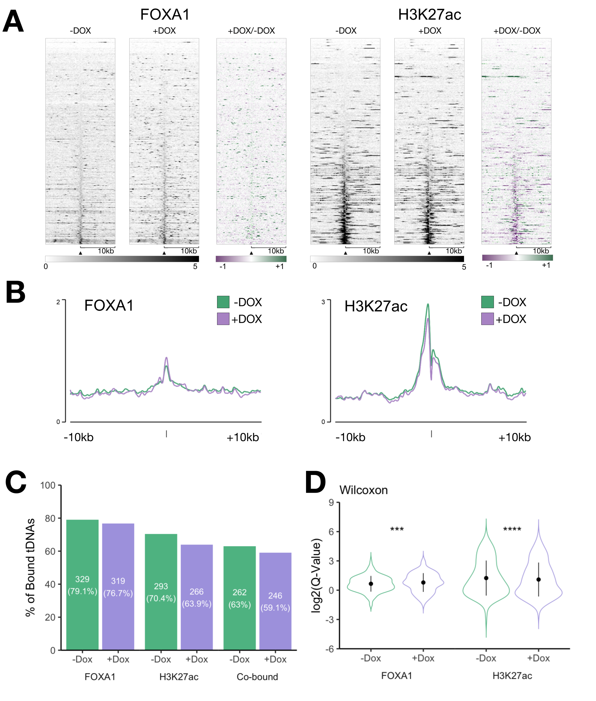
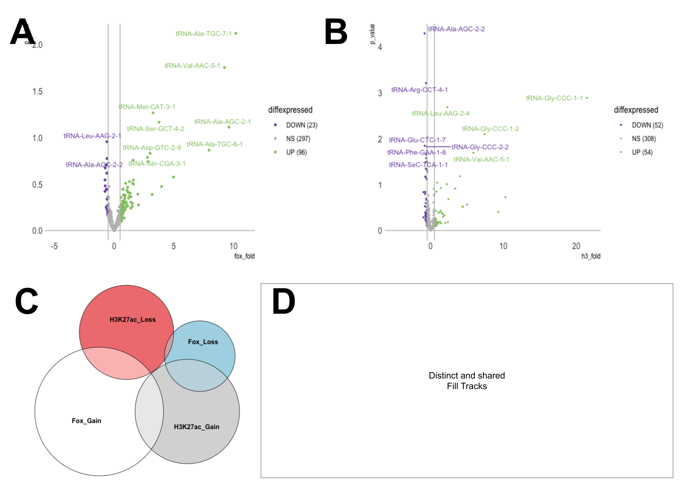
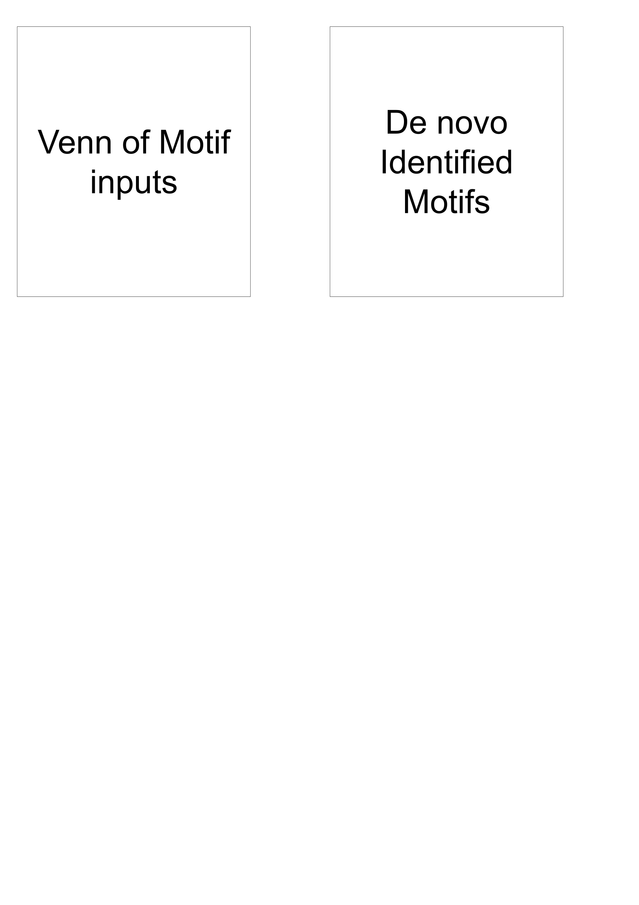

```{r setup, include=FALSE}
knitr::opts_chunk$set(
    echo = FALSE,
    message = FALSE,
    warning = FALSE,
    fig.align = "top",
    fig.pos = "H",
    out.width = '100%',
    fig.fullwidth = TRUE,
    fig.show = 'hold'
)
```

```{r load-pkgs, include=FALSE}
library(tidyverse) # Load the tidyverse. Functions are used for tidying data and creating plots via ggplot2.

library(kableExtra) # Load kableExtra. Table generation.

library(wordcountaddin) # Load wordcountaddin. Counts words and characters in text in an R markdown document.

library(rmdwc)

citation_count <-
    rmdcount(
        files = "report.Rmd",
        space = "[:space:]",
        word = "\\@",
        line = "\\n",
        exclude = "```\\{.*?```"
    )
```

```{r child = "abstract.Rmd"}
```

```{=tex}
\normalsize
\begin{flushright}
`r word_count("abstract.Rmd")` Words
\end{flushright}
\hrulefill\\
\setlength{\parindent}{10pt}
```
# Introduction

## tRNAs and Carcinogenesis

In Eukaryotes, transcription of DNA is tightly-regulated by three RNA polymerase enzymes.
RNA Polymerase III (Pol III), the largest of the three at 17-subunits[@vannini2012], produces a series of short non-coding RNAs, including U6 snRNA, 5S rRNA and transfer RNA (tRNA)[@dieci2007].
Approximately 80% of Pol III binding resides at tRNAs[@Raha2010a] --- adapters required to translate mRNAs into the amino acid protein sequence.
Initiation of tRNA transcription requires the binding of TFIIIC, a multisubunit complex, to internal tRNA promoters, the A and B boxes, which are located downstream of the transcription start site [@Schramm2002; @Lassar1983; @Galli1981].
This protein-protein interaction enables the recruitment of the TFIIIB promoter, composed of the TATA-box-binding protein (TBP), BDP1, and BRF1 polypeptides [@schramm2000].
TFIIIB occupies the region upstream of the transcription start site and binds to Pol III directly through BRF[@Khoo1994], positioning it at the initiation region [@kassavetis1990].

Protein synthesis by Pol III dictates cell growth and proliferation[@Brooks1977; @Baxter1978; @Zetterberg1965].
Deregulation of Pol II is associated with a range of cancers[@Zhang2018; @Pavon-Eternod2009], including ovarian and breast[@Winter2000; @Krishnan2016].
In healthy cells, tumour suppressors such as RB and p52 regulate Pol III transcription.
This is achieved through binding to TFIIIB, blocking interactions to both TFIIIC and Pol III[@White1996; @Cairns1998; @Sutcliffe2000; @Crighton2003].
Loss of RB and p53 in transformed cells consequently enhances Pol III transcription.
Contrarily, induction of onco-proteins MAP kinase Erk or c-Myc may stimulate Pol II expression through interactions with TFIIIB [@Gomez-Roman2003; @Felton-Edkins2003].
The relationship between Pol III and cell transformation directly implicates tRNAs in carcinogenesis.
~~Tumour cells contain tRNAs that are absent from the normal tissue of origin [@kuchino1978].~~

Specific tRNAs have also been shown to drive cancer progression[@Goodarzi2016].
For instance, overexpression of the transcription initiator tRNA~i~^Met^ alters global tRNA expression, increasing cell activity and proliferation[@Pavon-Eternod2013], as demonstrated in melanoma cells[@Birch2016].
~~Reporter assays revealed that some tRNA genes (tDNAs) act as insulators by restricting spread of heterochromatin[@raab2011; @Ebersole2011; @sizer2022].~~

## ER+ Breast Cancer and FOXA1

In 2020, female breast was the most commonly diagnosed cancer worldwide with over 2.2 million cases[@Sung2021].
Estrogen Receptor (ERα) drives 75% of breast cancers cancers[@allred2004].
Presence of ERα is generally prognostic of positive outcomes, due to it's use as a therapeutic target.
Estrogen levels are lowered using endocrine therapies with aromatase inhibitors; fulvestrant, a selective estrogen receptor down regulator (SERD) which binds and degrades the ER, and tamoxifen, a selective estrogen receptor modulator (SERM) which competes with estrogen for binding to ER[@Johnston2018].
However, resistance to endocrine therapy occurs in 40-50% of tumours from 5 years of diagnosis[@Anurag2018].

Forkhead box A1 (FOXA1) is a pioneer factor capable of directly initiating chromatin opening, facilliating binding of ERα and other transcription factors[@Costa1989; @Cirillo2002; @carroll2005; @laganière2005].
Early studies demonstrated that FOXA1 maps to \~50% of ER-chromatin binding sites.
Futhermore, silencing of FOXA1 reduces \~95% ER binding events [@Hurtado2011; @carroll2005].

~~FOXA1 is an established growth inhibitor in both ER+ breast cancer cells and ER- cells with forced ER expression[@Wolf2007]. Though binding to p27^kip1^, FOXA1 is also involved in recruiting tumour suppressor BRCA1[@Williamson2006; @Tsuchiya1999; @Fredersdorf1997].~~

The presence of FOXA1 determines treatment response in ER+ breast cancer; FOXA1 is associated with positive prognoses following treatment with tamoxifen[@Hurtado2011; @Badve2007].
However, FOXA1 and ERα has also been found to be overexpressed in some ER+ endocrine resistant breast cancer lines[@ross-innes2012].
Studies have shown that amplification of FOXA1 promotes endocrine-resistant growth and invasiveness by reprogramming the ER-transcriptome[@Fu2016].

Aberrant expression of tRNAs in breast cancers has been observed in several studies[@Hah2011; @Krishnan2016; @Pavon-Eternod2009; @Zhang2018].
Upon stimulation by estrogen, ERα+ breast cancer cells undergo extensive transcriptional changes, upregulating 90% of tRNA genes[@Hah2011].
Additionally, ERα amplifies alcohol-induced deregulation of tRNA^Leu^ by in MCF-7 cells[@zhong2014].

As ERα+ BC is reliant on FOXA1, the aim of this study was to determine whether FOXA1 elevates tDNA expression.
To achieve this, a bioinformatics approach was taken to analyse publically available FOXA1 and H3K27ac ChIP-seq datasets from Fu et al. (2019)[@fu2019] in the context of the MCF-7 cell line.
Here, identification of FOXA1 and H3K72ac co-localisation at tDNAs may provide insight into FOXA1's relevance in the altered tRNA expression associated with poor prognosis in ERα+ breast cancer.

------------------------------------------------------------------------

# Materials & Methods

## ChIP-seq Data from NCBI

FOXA1 and H3K27ac ChIP-seq was performed on genetically modified MCF7L cells (*insertion, using a lentiviral cDNA delivery system to express Dox-inducible FOXA1*) by the lab of Xiaoyong Fu, Baylor College of Medicine, and made publicly available on Dec 18 2019[@fu2019].
Datasets were deposited into the National Centre for Biotechnology Information (NCBI) Sequence Read Archive (SRA) Run Selector[@leinonen2010] under the accession number PRJNA513000 (Available at <https://www.ncbi.nlm.nih.gov/sra> ; Table \@ref(tab:data)).
Using "Genetic Manipulation Tools" within the Galaxy[@thegala2022] environment (v 23.0.rc1), SRAs were converted to FastQ files.
FastQ files were then aligned to the human genome assembly GRCh37 (hg19) by Bowtie2 (v 2.5.0)[@langmead2012] to output BAM files.

```{r data}
kbl(
  data.frame(
    "Experiment" = c(
      "PRJNA513000",
      "",
      "",
      "",
      "",
      "",
      ""
    ),
    "SRA" = c(
      "SRR8393424",
      "SRR8393425",
      "SRR8393426",
      "SRR8393427",
      "SRR8393428",
      "SRR8393431",
      "SRR8393432"
    ),
    "Factor" = c(
      "FOXA1",
      "",
      "",
      "H3K27ac",
      "",
      "None (input)",
      ""
    ),
    "Tissue" = c(
      "MCF-7LP",
      "",
      "",
      "",
      "",
      "",
      ""
    ),
    "Assembly" = c(
      "GRCh37 (Hg19)",
      "",
      "",
      "",
      "",
      "",
      ""
    )
  ),
  
  booktabs = TRUE,
  caption = "Publicly available ChIP-seq SRA files aquired from the NCBI SRA database (accession no. PRJNA512997).",
  format = "markdown"
)
```

### EaSeq for the Quantification of Signals at tDNAs

BAM files were uploaded into EaSeq (v1.111) as "Datasets" using the standard settings for Chip-seq data.
GRCh37 (hg19) tRNA sequences (n = 606) were downloaded as a "Geneset" from the UCSC Table Browser[@Karolchik2004], (available at <https://genome.ucsc.edu>).
High-confidence tRNAs (n = 416) identified by the GtRNAdb[@Chan2016] were extracted as a "Regionset".

Signal peak intensities surrounding tRNAs were quantified using the EaSeq "quantify" tool.
Here the default settings "Normalize to reads per million" and "Normalize counts to DNA-fragments" were left checked.
The default setting "Normalise to a signal of 1000 bp" was unchecked.
The window size was offset ±500bp from the start of each tRNA gene.
Generated values are referred to as "Q-values".

To quantify upstream and downstream signals, the "quantify" tool was used with adjusted window sizes.
The upstream region was defined as 500 bp preceding and the first nucleotide of tRNA loci.
Thus, the start position was offset to 0 bp, and the end position was offset to -500 bp.
The downstream region constitutes the 500 bp region beginning with the first nucleotide of tRNA gene body.
The start position was offset to 1 bp, and the end position was offset to 500 bp.

Following quantification, tRNA binding events were arranged in ascending order of -Dox Q-value and visualised as heatmaps.
Data was also visualised with the "heatmap", "average", "overlay", and "filltrack" tools.
EaSeq[@lerdrup2016] is avaiable at <http://easeq.net>.

## Motif Analysis

Motif analysis was carried out in active +Dox tDNA genes which had the largest significant increase in FOXA1 or H3K27ac Q-values following ChIP-seq.

!!1!!!!1
!!!!!!1

Multiple EM for Motif Elicitation ChIP (MEME) Suite

## Statistics

Statistical analysis and visualisation was generated with R[@r] (v 4.2.3) with the tidyverse[@wickham2019] and ggpubr[@ggpubr] packages.

Group differences were determined by Mann-Whitney U, Wilcoxon signed-rank test, and the Chi-squared test.

## ChIP-Seq and ChIP-qPCR

MCF-7L cells were grown in PRF medium with 5% CS-FBS and −/+ Dox.Cells were cross-linked with 1% formaldehyde for 10 mins.
Corss-linking was inhibited by quenching (1/20V, 125 mM glycine).
Cells were washed in cold PBS and harvested in cold PBS with protease inhibitors (Roche).
Pelleted cells were resuspended in cytosolic and then lysed in nuclear lysis buffer (10-20 min), and sheared at high output (Bioruptor, Diagenode; 4 °C, 30s per sonication cycle for 20 min).
Sonicated lysates were cleared by centrifugation (20,000 × g, 10 min) and diluted (4 times) before preincubation with protein-A/G beads (Santa Cruz; 4 °C, 30 min).

ChIP was performed by overnight incubation (4 °C) with antibody against human FOXA1 (Abcam, ab23738) or H3K27ac (Active Motif, #39134), followed by an additional incubation with protein-A/G beads (1h).
For FOXA1 ChIP-seq, spike-in Drosophila melanogaster chromatin was added with the antibody against histone variant H2Av (Active Motif, \# 61752).
The beads were washed with low and high salt wash buffer, once with LiCl wash buffer (20 mM Tris pH 8.0, 1 mM EDTA, 250 mM LiCl, 1% Nonidet P-40, 1% sodium deoxycholate), and once with TE buffer.
DNA was eluted (50 mM NaHCO3 and 1% SDS) and then supplemented with NaCl (300 mM).
Cross-links were reversed by incubating overnight (67 °C).
RNA was digested at 37 °C with RNase A (0.1 mg/mL, 30 min).
DNA was purified with a PCR purification kit (Qiagen).

Indexed libraries were prepared from ChIP DNA using the KAPA Hyper Library Preparation Kit (Kapa Biosystems).
Libraries were amplified by PCR (12 cycles), and then assessed for size distribution using the 4200 TapeStation High Sensitivity D1000 ScreenTape (Agilent Technologies) and quantified using the Qubit dsDNA HS Assay Kit (ThermoFisher).
The indexed libraries were multiplexed, 10 libraries per pool.
Real time quantitative PCR (qPCR) was perfomed using the KAPA Library Quantification Kit (KAPA Biosystems) and then sequenced on the Illumina NextSeq500 using the high-output 75 bp single-read configuration.

------------------------------------------------------------------------

# Results

## Localisation of FOXA1 and H3k27ac at tRNA genes in MCF-7 cells

Estrogen stimulates the production of tRNAs [@Hah2011].
The estrogen receptor is dependent on FOXA1; ChIP-seq analysis has shown that FOXA1 reprograms chromatin in MCF-7 cells[@fu2016].
To investigate whether FOXA1 enhances tDNA expression, a doxycycline (Dox) inducible OE system in MCF-7 cells was used to achieve expression comparable to tamoxifen-resistant cells (TamR).
ChIP-seq analysis was carried out for FOXA1 and H3K27ac; open, H3K27ac denotes accessible chromatin and is used to identify active promoters.

It was expected that FOXA1 would alter tDNA activity.
Mapped reads of FOXA1 and H3K27ac binding was quantified (Q-values) relative to ±500 bp flanking regions.
Binding events were visualised as heatmaps and ordered by increasing -DOX Q-value.
This revealed a concentration of FOXA1 and H3k27ac at approximately half of tDNAs, relative to ±10 kb flanking regions.

Upon FOXA1 induction, FOXA1 binding increases at a small proportion of tRNAs genes.
H3K27ac binding decreases at approximately half of tRNA genes (Figure \@ref(fig:results-1)A).
This was confirmed by average signal intensity plots of FOXA1 and H3K27ac binding (Figure \@ref(fig:results-1)B).
Input reads generated minimal peak enrichment (Supplementary Figure X).

Peaks were classified as binding events if Q-values exceeded input values (log~2~(Q-value fold-change) \>0) (Figure \@ref(fig:results-1)C).
Before FOXA1 OE, FOXA1 interacts with 329 tRNA genes and H3K27ac with 293 tRNA genes.
The majority of these events are co-binding, with both FOXA1 and H3K27ac binding to 262 tDNAs.
Upon FOXA1 OE, the number of FOXA1 binding sites decrease to 319; 40 are lost and 30 are gained, whilst 309 pre-existing sites remained.
H3K27ac sites also decrease to 266 tDNAs; 50 are lost and 23 are gained, whilst 239 pre-existing sites remained.
Correspondingly, co-binding events lower to 246; 44 are lost and 28 are gained, whilst 230 pre-existing sites remained.

In response to FOXA1 induction, FOXA1 density statistically increased.
Median FOXA1 q-values were (Figure \@ref(fig:results-1)D) increased 1.11-fold (p = 0.00079).
For H3K27ac, median q-values decreased by 0.99-fold, however this change was not statistically significant (Figure \@ref(fig:results-1)D).
Together, these results support the notion that FOXA1 and H3K27ac bind to tDNAs.

```{r results-1, out.width = '100%', fig.cap = "Comparisons of FOXA1 and H3K27ac binding at tDNAs, with and without Dox.(A) Heatmaps of FOXA1 and H3K27ac across hg19 tRNA genes in MCF-7 cells. Genes arranged in order of increasing -Dox Q-value. Ratiometric heatmaps represent the log2 ratio between -Dox and +Dox peaks. Windows represent ±10kb from the centre of the gene. N = 416. (B) Average signal intensity overlay of FOXA1 and H3K27ac. Windows represent ±10kb from the centre of the gene. (C) Bar plots of the percentage of cells bound by FOXA1 and H3K27ac. (D) Violin plots of FOXA1 and H3K27ac Q-values within ±500bp of the gene body. *p < 0.05."}

```

## FOXA1 alters H3K27ac binding levels

To elucidate how FOXA1 impacts tDNA levels, tDNAs that were differently enriched upon FOXA1 OE were categorised as gained (UP) and lost (DN) (fold-change \> 1.5, *P*-value \> 1e-3).
This discovered that substantially more tDNAs gained (UP) FOXA1 binding than lost (DN) (96 vs. 62), whilst 258 tDNAs remained relatively unchanged (Figure \@ref(fig:results-2)A, left).
For H3K27ac, 54 tDNAs gained (UP) and 124 lost (DN) H3K27ac (Figure \@ref(fig:results-2)A, right), whereas 236 tDNAs remained relatively unchanged.
As expected, median q-values were significantly gained or lost at GAIN and LOSS tDNAs, respectively (Figure \@ref(fig:results-2)B).

Focusing on GAIN tDNAs, 95 gain (UP) FOXA1 and 54 gain (UP) H3K27ac (Figure \@ref(fig:results-2)C).
Of this subset (n = 150), 14% gain both FOXA1 and H3K27ac.
Examples of exclusive and co-bound tDNAs are shown in Figure \@ref(fig:results-2)D.

SUMMARY

```{r results-2, out.width='100%', fig.cap = "FOXA1 OE impacts binding of FOXA1 and H3K27ac at tRNA genes. (A) Volcano plots of FOXA1 (n = 416) and H3K27ac (n = 414) q-values in +Dox vs. −Dox cells. (Left) The purple and green dots correspond to the regions with UP and DN FOXA1, respectively. (Right) The orange and green dots correspond to the regions with UP and DN H3K27ac, respectively. The threhold for calling was set fold-change > 1.5 and P < 1e-3. (B) Violin plots of the q-values of GAIN or LOSS tRNA genes. ****p < 0.0001. (C) Venn diagram representing the overlap between FOXA1 and H3K27ac GAIN regions. (D) Filltrack examples of seperate and co-occuring FOXA1 and H3K27ac GAIN events within ± 2 kb of tDNAs. The black line represents the gene body."}

```

## Activated tDNAs are bound by FOXA1

The next step was to investigate the impact of FOXA1 on tDNA activity.
Almost half of human tDNAs are silent or poorly expressed [@Torres2019].
Thus, tDNAs were classified as 'active' if H3K27ac Q-values exceeded the median -DOX value (Q \> 1.808).
The q-value density of inactive tDNAs was somewhat altered (p = 0.043), with median FOXA1 q-values decreasing 0.81-fold (Figure \@ref(fig:results-3)A).
The density of active tDNAsdid not significantly change, though the median q-value did decrease 0.81-fold.

Overexpression of FOXA1 altered the number of active and inactive tDNAs by just 1 (Supplementary Figures X).
However, 50 tDNAs became inactive (LOSS) and 25 became activate (GAIN), whilst the activity status of 343 (82.5%) tDNAs remained not changed (NC) (Figure \@ref(fig:results-3)B).
As expected, the q-value density of lost, gained, and no-change tDNAs was changed upon FOXA1 OE (Figure \@ref(fig:results-3)C).
Q-values decreased 0.59-fold for LOSS, 0.92-fold for NC tDNAs, and 1.95-fold for GAIN tDNAs.

Superimposing GAIN and LOSS tDNAs with UP and DOWN tDNAs (Figure \@ref(fig:results-2)C) revealed 23 tDNAs that become active upon FOXA1 OE, 17 also reasonably gained H3K27ac (Figure \@ref(fig:results-3)D).
However, only 9 tDNAs gained both H3K27ac and FOXA1; examples of these tDNAs are shown in Figure \@ref(fig:results-3)E.

SUMMARY

```{r results-3, out.width = '100%', fig.cap = "(A) Violin plot of H3K27ac q-values within ±500bp of the gene body of inactive and active tDNAs. *p < 0.05. (B) Barplot of tDNAs catagorised by activity change upon FOXA1 OE. tDNAs are classed as inactivated (LOSS), no-change (NC), and activated(GAIN). (C) Violin plot of tDNA Q-values, catagorised as they are in B. *p < 0.05, **p < 0.01. (D) Venn diagram representing the overlap between tDNAs classed as GAIN and UP. (E). Filltrack examples of co-occuring FOXA1 UP and H3K27ac GAIN events within ± 2 kb of tDNAs. The black line represents the gene body."}

```

## Relative Position

-   Relative position (not very interesting)

-   Binding at isotopes?
    Certain AA more up than others?

## Motif Analysis

#### Why?

### What?

MEME CentriMo to identify de novo motifs that are enriched at tDNAs which gain both FOXA1 and H3k27ac

-   relative to other tDNAS (gain/lose, lose/lose, lose/gain)

-   FOXA1 not enriched

-   Look at ERE, AP-1, others?

-   Top 3 motifs (fisher E values) - IRF7, ERR3, NR4A1

-   A and B box motifs as a control?
    How?

    -   All downstream

    -   tDNAs where 'matching sequences' all best matches = code for valine

    -   Branched amino acids associated with lower BC risk

#### Suggests?

```{r results-4, out.width = '100%', fig.cap = "(A) . (B). (C)"}

```

## Figure 5

-   Localisation of FOXA1 at individual tDNA genes in MCF-7 cells

Why?

-   tRNAs implicated in cancer

-   Are they upregulated?

-   Look at gain function/gain h3/fox

-   Motif ontology

-   

What?

Suggests?

```{r clusters}
knitr::kable(
  data.frame(
    "Group" = c(
      "ALOXE",
      "Ebersole",
      "HES7",
      "Per1",
      "TMEM107",
      "Arg-CCG",
      "Glu-TTC",
      "iMET",
      "Met",
      "SeC"
    ),
    "Function" = c(
      "Insulator Function[@raab2011; @sizer2022]",
      "Insulator Function[@Ebersole2011; @sizer2022]",
      "",
      "",
      "Insulator Function [@raab2011; @sizer2022]",
      "Implicated in Cancer Progression[@Goodarzi2016]",
      "Implicated in Cancer Progression[@Goodarzi2016]",
      "Proliferation of Breast Cancer",
      "iMet Control",
      "Involved in REDOX [@Sangha2022]"
    )
  ),
  booktabs = TRUE,
  caption = ".",
  format = "markdown"
) 
```

------------------------------------------------------------------------

# Discussion

-   FOXA1 alone not efficient to increase activity

    -   p300

-   FOXA1 moves nucleosomes to make other TF accessible?

-   Differences in nucleosome positioning will contribute to the distinct density patterns of modified histones, as nucleosomes are excluded from active tRNA promoters and enriched in flanking regions^[8](https://www.nature.com/articles/nrg3001#ref-CR8 "Barski, A. et al. Pol II and its associated epigenetic marks are present at Pol III-transcribed noncoding RNA genes. Nature Struct. Mol. Biol. 17, 629–634 (2010).")^.

-   Brf1 required for iMET txn

-   Loses fox = weak binding?

-   Dynamic vs stable marks

-   ATAC-seq

# Conclusion

```{=tex}
\begin{flushright}
`r word_count("report.Rmd") - 2` Words
\end{flushright}
\footnotesize
```

------------------------------------------------------------------------

# References
